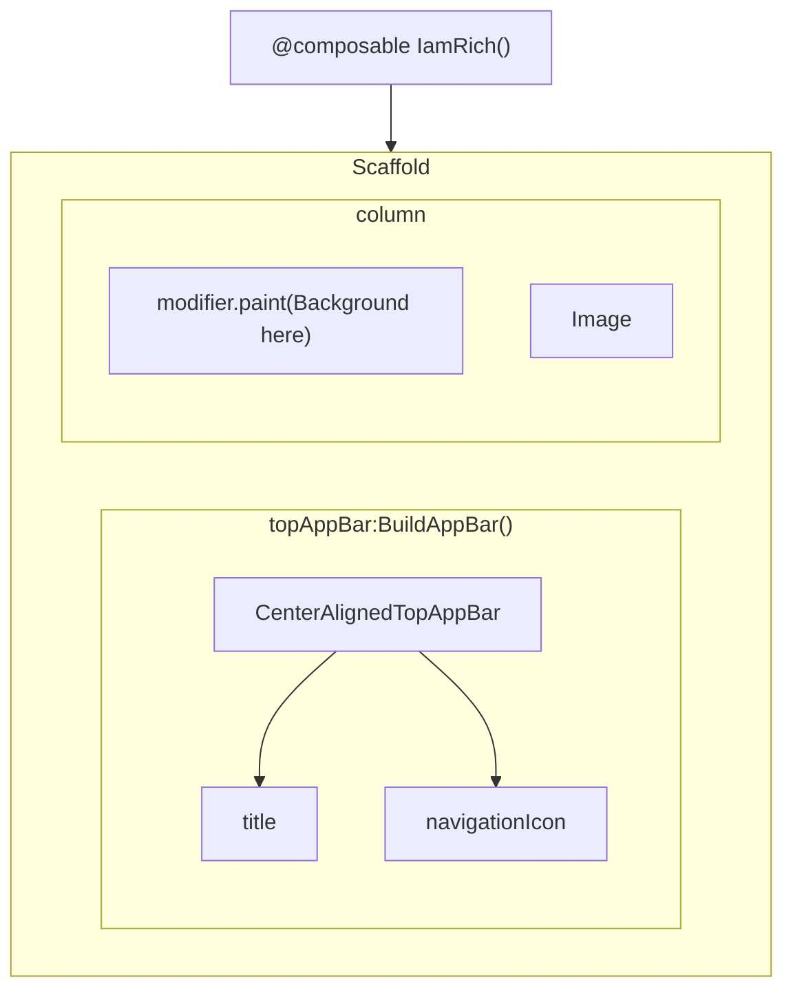

# Jetpack Compose series: No.1 I am rich

## 1. Introduction
This is a very simple app develop by compose.
The app only contains one image and background.
The final app will look like below.


## 2. UI structure

## 3. Main implementation
### 3.1 @Composable IamRichApp
```kotlin
@OptIn(ExperimentalMaterial3Api::class)
@Composable
fun IamRichApp(modifier: Modifier = Modifier) {
    Scaffold(containerColor = Color.LightGray,
        modifier = modifier,
        topBar = { BuildAppBar() }) { contentPadding ->
        Column(
            verticalArrangement = Arrangement.Center,
            horizontalAlignment = Alignment.CenterHorizontally,
            modifier = modifier
                .fillMaxSize()
                .paint(painterResource(id = R.drawable.background),
                    contentScale = ContentScale.Crop)
        ) {
            val imageModifier = Modifier
                .padding(contentPadding)
                .scale(1.5f)
            Image(
                modifier = imageModifier,
                painter = painterResource(id = R.drawable.diamond),
                contentDescription = "This a diamond"
            )
        }
    }
}
```

### 3.2 @Composable BuildAppBar
```kotlin
/**
 * implement top app bar
 */
@OptIn(ExperimentalMaterial3Api::class)
@Composable
fun BuildAppBar() {
    CenterAlignedTopAppBar(colors = TopAppBarDefaults.smallTopAppBarColors(containerColor = Color.Blue),
        title = { Text("I am Rich", color = Color.White) },
        navigationIcon = {
            Icon(imageVector = Icons.Default.Menu, contentDescription = "Menu", tint = Color.White)
        })
}
```

### 4. Memo for later reference
```
The Scaffold is used to create structure including top app bar
The Layout like Column, Row, ConstrainLayout have modifier field which we can use to 
change the background. Even the background image by tapping to the paint
The modifier also could change the scale of target composable
```
